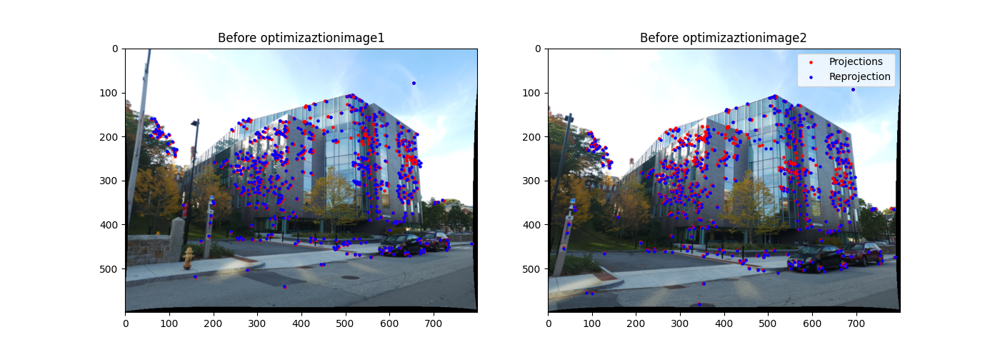
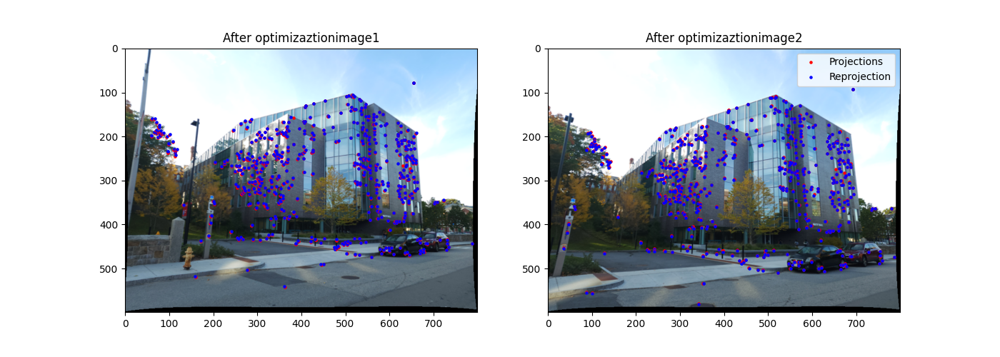
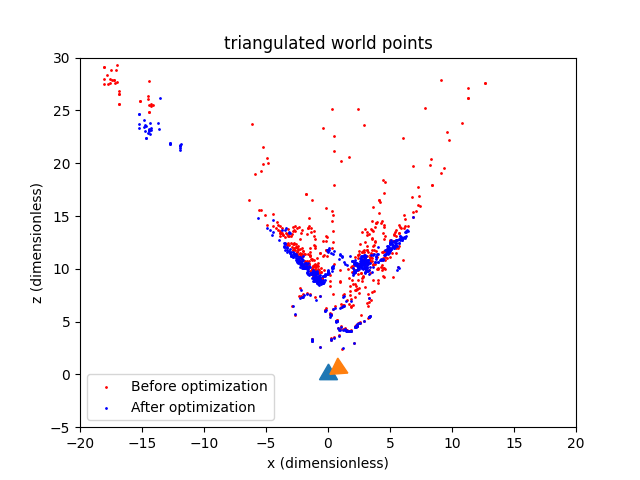

# SfM-and-NeRF

## to run the code:
### run from the p02 directory and 
### python3 .\samane_p2\Phase1\Wrapper.py

## Reprojection before optimization
 

## Reprojection after optimization
 

## Camera pose 1 and 2
 
